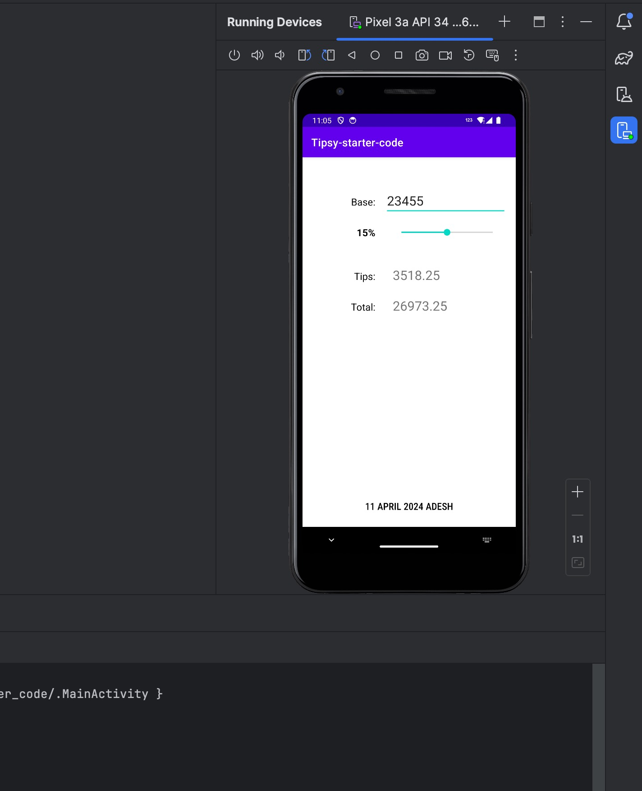
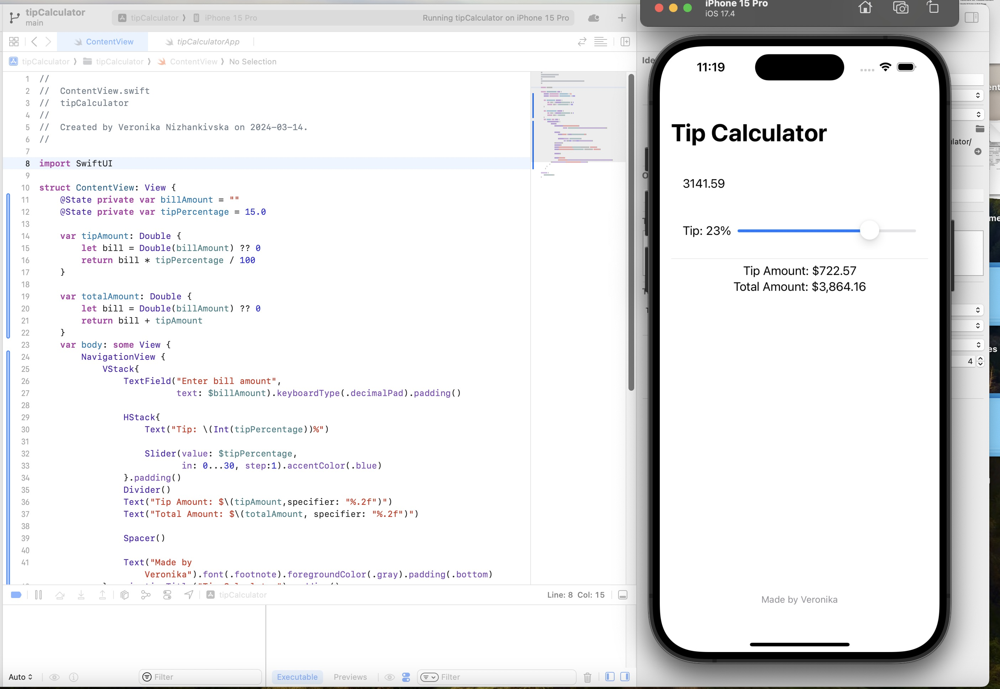
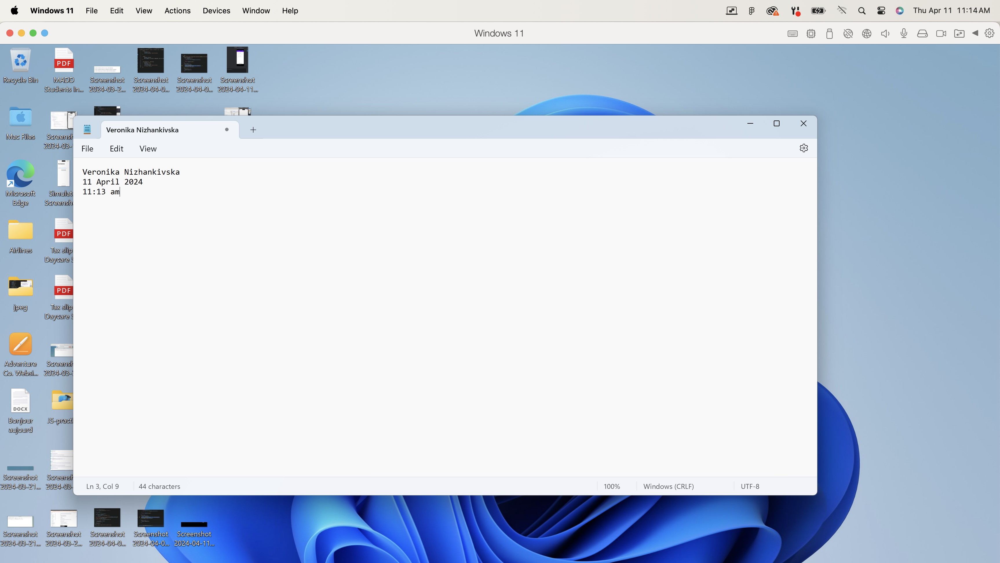

#Veronika Nizhankivska
##Username: nizh-0001

My JavaScript answer:
`
let weight = 90;
let height = 1.91;
let bmi = 0;

function calculateBMI(weight, height) {
bmi = weight / Math.pow(height, 2);
return bmi;
}

calculateBMI(weight, height);

function interpretBMI(bmi) {
if (bmi < 18.5) {
return "Underweight";
} else if ((bmi >= 18.5) & (bmi < 25)) {
return "Normal weight";
} else if ((bmi >= 25) & (bmi < 30)) {
return "Overweight";
} else if (bmi >= 30) {
return "Obese";
}
}

console.log(
`If your weight: ${weight} and height: ${height} -Your mbi is ${bmi} You are = ${interpretBMI(
    bmi
  )} `
);
`

